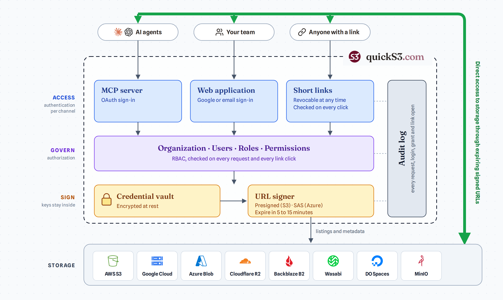
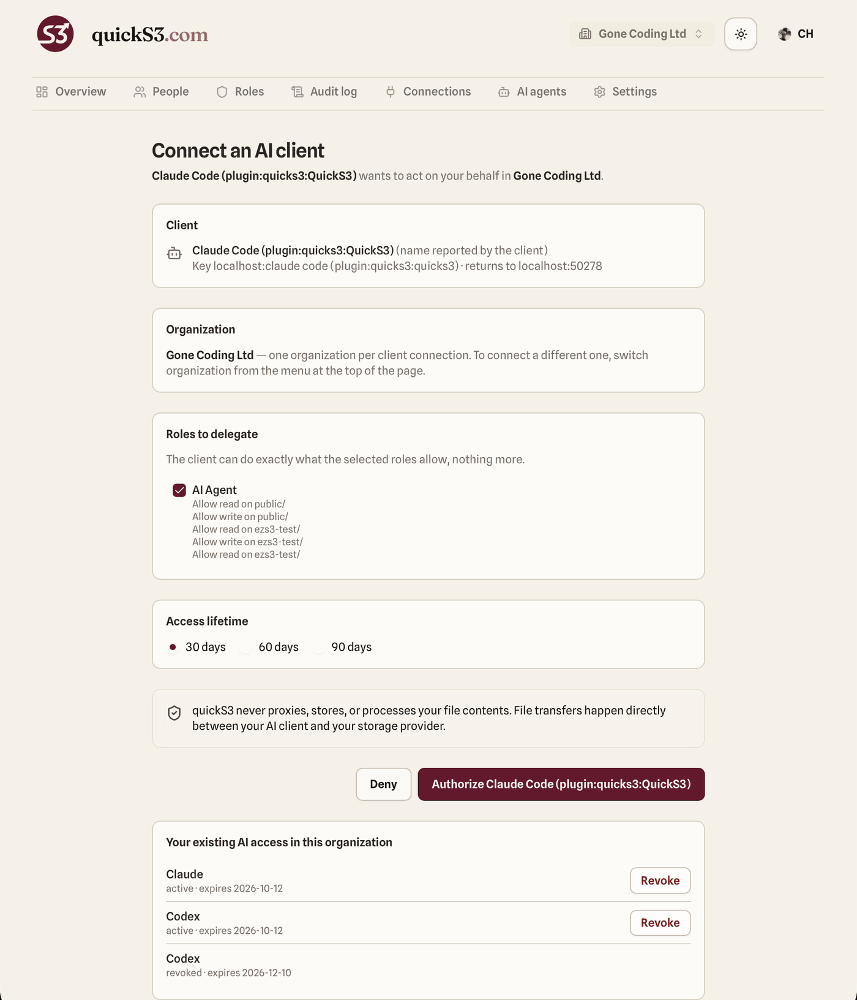

# quickS3 agent plugin

Lets coding agents browse, transfer, and share files through [quickS3](https://quicks3.com). Agents act only with the quickS3 roles you delegate during OAuth consent, and file bytes go directly between the agent and your storage provider.

This repository contains the client plugin and skill. The MCP server itself is hosted by quickS3 at `https://quicks3.com/mcp`; its source is not in this repository.

## What you can ask

- "List the folders I can access in quickS3."
- "Show me the files in `reports/2026/` of the `documents` bucket."
- "Download `reports/q3.pdf` and summarize it."
- "Upload `build/release.zip` to `releases/` without overwriting anything."
- "Create a share link for `contracts/nda.pdf` that lasts 7 days."

## How it works



An AI agent acts on behalf of your quickS3 user account. It can use only the roles you delegate to it, which are some or all of your own roles, so it can never do more than you can:

- **Access.** The agent signs in with OAuth. You choose which of your quickS3 roles it gets, and you can revoke the grant at any time.
- **Govern.** On every request and every link click, quickS3 checks the grant, the delegated roles, and your own current membership. If you lose a role or leave the organization, the agent loses that access too.
- **Sign.** Storage credentials stay encrypted inside quickS3. The agent never sees them; it receives signed URLs that expire in 5 to 15 minutes.
- **Transfer.** File bytes go directly between the agent and your storage provider. Only listings and metadata pass through the MCP server.
- **Audit.** Every request, sign-in, grant, and link open is recorded in the quickS3 audit log.

## Requirements

- A quickS3 organization with at least one storage connection. New to quickS3? [Start a free 14-day trial](https://quicks3.com).
- A quickS3 role that gives you access to the buckets or folders the agent should use.

Supported providers: AWS S3, Google Cloud Storage, Azure Blob Storage, Cloudflare R2, Backblaze B2, Wasabi, DigitalOcean Spaces, MinIO, and other S3-compatible services.

The plugin bundles:

- the quickS3 hosted MCP server (`https://quicks3.com/mcp`, Streamable HTTP with OAuth)
- the `quicks3-operator` skill, which teaches the agent to list narrowly, download through single-use links, share files only when asked, and upload without overwriting by default

## Install in Claude Code

In Claude Code, run:

```
/plugin marketplace add QuickS3-com/skill
/plugin install quicks3@quicks3
```

Or from a shell:

```bash
claude plugin marketplace add QuickS3-com/skill
```

```bash
claude plugin install quicks3@quicks3
```

Run `/mcp` in Claude Code and choose `QuickS3` to sign in. quickS3 opens a consent page where you choose the roles to delegate and how long the access lasts (30, 60, or 90 days). The agent can do exactly what those roles allow, nothing more. You can revoke the grant at any time from the same page or from **AI agents** in quickS3.

<p align="center">
  
</p>

## Claude.ai and Claude Desktop

1. In Claude, open **Settings → Connectors** and choose **Add custom connector**.
2. Enter `https://quicks3.com/mcp` as the URL and complete the quickS3 sign-in.
3. Optional: to add the skill, zip the [`quicks3-operator`](plugins/quicks3/skills/quicks3-operator) folder and upload it in **Settings → Capabilities → Skills**.

## ChatGPT

1. In ChatGPT's settings, add a custom connector.
2. Enter `https://quicks3.com/mcp` as the URL and choose OAuth as the authentication.
3. ChatGPT opens quickS3 so you can approve the connector and choose its roles.

## Install in Codex

```bash
codex plugin marketplace add https://github.com/QuickS3-com/skill.git
```

```bash
codex plugin add quicks3@quicks3
```

Codex opens a browser for quickS3 sign-in. Choose the roles to delegate; you can revoke the grant at any time in quickS3.

## Other MCP clients

Any client that supports remote MCP servers with OAuth can connect to `https://quicks3.com/mcp` directly. The skill in [`plugins/quicks3/skills/quicks3-operator`](plugins/quicks3/skills/quicks3-operator) is a plain `SKILL.md` and can be copied into any agent that reads skills.

## Tools

| Tool | Effect |
| --- | --- |
| `list_connections` | Storage connections the grant can see, with their buckets |
| `list_buckets` | Refreshes the visible buckets of one connection |
| `list_objects` | One folder level, paginated |
| `create_download_link` | Single-use link, valid 5 minutes |
| `create_share_link` | Public share link for someone else, valid 5 minutes to 30 days (default 24 hours) |
| `create_upload_url` | Presigned `PUT` URL, valid 15 minutes, no overwrite by default |

See [`tool-contract.md`](plugins/quicks3/skills/quicks3-operator/references/tool-contract.md) for schemas and errors.

## Troubleshooting

| Symptom | What to do |
| --- | --- |
| quickS3 tools are missing | Run `/mcp` in Claude Code (or your client's connector settings) and sign in to `QuickS3` again. |
| "Access denied" | The roles you delegated don't cover that connection, bucket, or folder, or the grant was revoked or expired. Update or renew the grant in quickS3. |
| Upload refused because the object exists | The agent doesn't overwrite by default. Tell it explicitly to replace the file. |
| Upload too large | The MCP server supports single uploads only (no multipart yet). Use the quickS3 web app for very large files. |
| Download link fails | Links are single-use and last 5 minutes. Ask the agent to create a new one. |
| Share link shows "Link unavailable" | The grant it was created under was revoked or expired, or read access was removed. |

## Learn more

- [Setup guide](https://quicks3.com/s3-mcp-server/)
- [Security model](https://quicks3.com/docs/security/model/)
- [Privacy policy](https://quicks3.com/privacy/)
